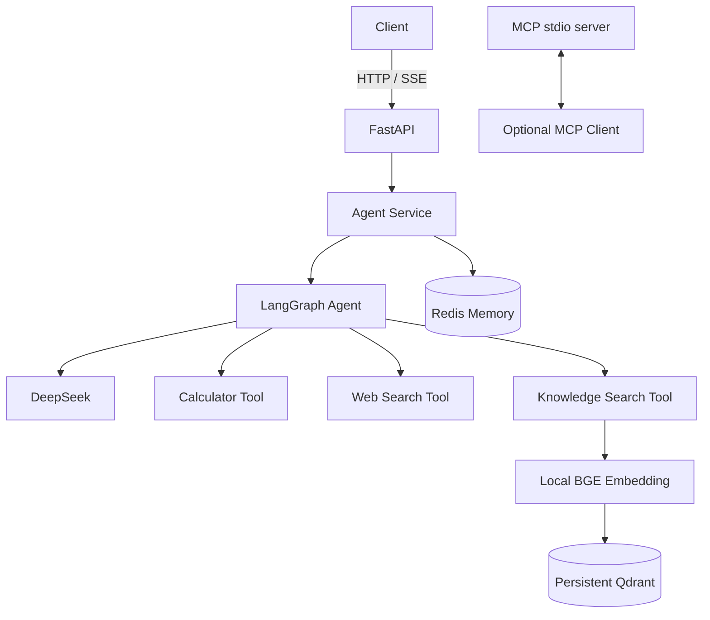
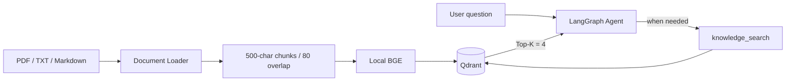
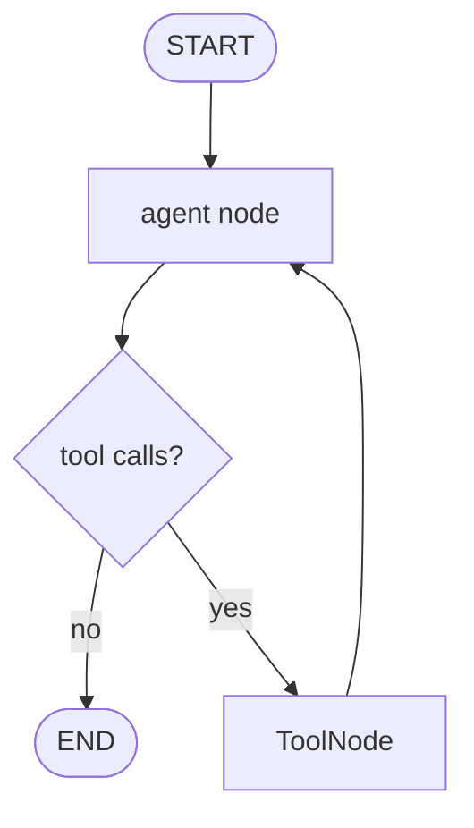

# AgentHub

基于 **LangGraph + DeepSeek + RAG + Redis Memory + FastAPI** 的智能知识
Agent 后端。项目把 RAG、计算和 Web Search 封装成 Tool，由模型在 Agent Loop 中
动态选择，并通过 `user_id + conversation_id` 隔离多用户会话。

> 当前版本：`0.1.0`。核心模块、LangGraph 工具循环、Qdrant 持久化、会话隔离和
> API 契约已通过 13 项离线测试。DeepSeek 工具调用、BGE/Qdrant 检索、SSE 流式输出
> 与 MCP stdio 调用均已完成真实链路验证；Redis 与 Docker 路径需在对应服务启动后使用。

## Architecture



## Features

- **LangGraph Agent Loop**：`agent → tools → agent`，支持连续工具调用。
- **DeepSeek Tool Calling**：统一模型工厂，业务文件不直接创建 `ChatOpenAI`。
- **三个核心工具**：计算器、本地知识检索、Wikipedia Web Search。
- **持久化 RAG**：PDF/TXT/Markdown → Chunk → BGE → Qdrant → Top-K。
- **多会话 Memory**：Redis key 为 `agenthub:{user_id}:{conversation_id}`。
- **FastAPI**：健康检查、Agent 对话、SSE、文档上传和知识库统计。
- **SSE Token Streaming**：通过模型 token callback 推送 `token` 和 `done` 事件。
- **MCP 示例**：stdio 工具发现与调用客户端，以及确定性的天气 Demo Server。
- **Docker Compose**：API + Redis，Qdrant 使用本地持久化模式。

## Tech Stack

| Layer | Technology |
|---|---|
| Agent | LangGraph 0.2.40, LangChain 0.3.1 |
| LLM | DeepSeek `deepseek-flash` |
| API | FastAPI 0.115, SSE |
| RAG | BGE Small Chinese, Qdrant local mode |
| Memory | Redis 5 client, in-memory development fallback |
| MCP | MCP Python SDK 1.12 |
| Runtime | Python 3.12, Docker Compose |

## Project layout

```text
AgentHub/
├── app/
│   ├── api/              # Chat, SSE and document endpoints
│   ├── agent/            # State, nodes, graph and orchestration service
│   ├── llm/              # Centralized DeepSeek model factory
│   ├── tools/            # Calculator, RAG and web tools
│   ├── rag/              # Loader, splitter, embeddings and Qdrant
│   ├── memory/           # Redis and in-memory backends
│   ├── mcp/              # Optional stdio MCP client
│   ├── config.py
│   └── main.py
├── data/
│   ├── documents/
│   └── qdrant/
├── docs/
├── examples/
├── scripts/
├── tests/
├── Dockerfile
└── docker-compose.yml
```

## Quick Start

### 1. Create the Python 3.12 environment

Windows PowerShell:

```powershell
cd D:\CMLM_experiment_project\agenthub_modernization\AgentHub
py -3.12 -m venv .venv
.\.venv\Scripts\Activate.ps1
python -m pip install -r requirements-dev.txt
```

### 2. Configure DeepSeek

```powershell
Copy-Item .env.example .env
```

Edit `.env`:

```env
DEEPSEEK_API_KEY=your_key_here
```

`.env` is ignored by Git. Do not commit it or paste the Key into issue logs.

The first RAG request downloads `BAAI/bge-small-zh-v1.5` to:

```text
AgentHub/.cache/huggingface/
```

The model cache therefore stays on the same D-drive project path instead of the
default C-drive user cache.

### 3. Start Redis and API

Start only Redis with Docker:

```powershell
docker compose up -d redis
```

Then start AgentHub:

```powershell
.\start-agenthub.cmd
```

Open Swagger at <http://localhost:8000/docs>.

If Redis is unavailable and `MEMORY_FALLBACK_TO_LOCAL=true`, AgentHub uses process
memory for development. This fallback is not persistent across restarts.

### 4. Ingest the demo document

```powershell
.\scripts\ingest_demo.ps1
```

The first run downloads the BGE model, creates `data/qdrant`, creates collection
`agenthub_knowledge`, and indexes the demo Markdown file.

## API

| Method | Endpoint | Purpose |
|---|---|---|
| `GET` | `/health` | Configuration-level health check |
| `POST` | `/chat` | Run the complete Agent Loop |
| `POST` | `/chat/stream` | Stream tokens and final metadata with SSE |
| `POST` | `/documents/upload` | Index PDF/TXT/Markdown into Qdrant |
| `GET` | `/documents/stats` | Return collection and point count |

### Chat

```bash
curl -X POST http://localhost:8000/chat \
  -H "Content-Type: application/json" \
  -d '{
    "user_id": "user_001",
    "conversation_id": "conv_001",
    "message": "请计算 123 乘以 456"
  }'
```

Response:

```json
{
  "answer": "123 × 456 = 56088",
  "tool_calls": ["calculator"],
  "sources": []
}
```

### SSE

`POST /chat/stream` uses the same JSON request. Events follow this contract:

```text
event: token
data: "Lang"

event: done
data: {"answer":"...","tool_calls":["knowledge_search"],"sources":[...]}
```

### Upload

```bash
curl -X POST http://localhost:8000/documents/upload \
  -F "file=@data/documents/agenthub_demo.md;type=text/markdown"
```

Supported types are `.pdf`, `.txt`, `.md`, and `.markdown`; maximum upload size is
20 MB.

## RAG



RAG 是 Agent Tool，而不是所有请求都执行的固定前置流程。只有模型判断问题需要
本地材料时才调用 `knowledge_search`。Tool 输出包含上下文与 sources，最终 API
从 LangGraph 的 `ToolMessage` 中提取 sources。

## Memory

- **Short-term state**：当前 LangGraph run 的 messages。
- **Conversation memory**：Redis 中保存的用户与助手最终消息。
- **Isolation key**：`agenthub:{user_id}:{conversation_id}`。
- **TTL**：默认 7 天，可用 `MEMORY_TTL_SECONDS=0` 关闭过期。

工具中间消息不写入长期对话历史，减少下一轮上下文噪声；API 仍从当前 run 中返回
工具名和 sources。

## LangGraph Workflow



`ToolNode` 根据 DeepSeek 返回的 tool schema 调用对应 Python Tool，将结果封装成
`ToolMessage` 写回 state，随后再次进入 agent node。图会循环到模型生成不含
tool call 的最终回答。

## MCP demo

Set these values in `.env`:

```env
MCP_SERVER_COMMAND=.venv/Scripts/python.exe
MCP_SERVER_ARGS=["examples/mcp_demo_server.py"]
```

Run:

```powershell
.\.venv\Scripts\python.exe scripts\mcp_smoke.py
```

The client first discovers the `weather` tool, then calls it over MCP stdio. MCP is
kept optional so an external server failure cannot block the core Agent API.

## Five demo cases

| Case | Prompt | Expected path |
|---|---|---|
| Calculator | `请计算 123×456` | Agent → calculator → Agent |
| Direct LLM | `用三句话解释 Agent` | Agent → answer |
| RAG | `从知识库解释 AgentHub 的 Memory 设计` | Agent → knowledge_search → Agent |
| Memory | `上一轮我问了什么？` | Redis history → Agent |
| Multi-step | `查知识库里有几个工作流阶段，再乘以 20` | RAG → Agent → calculator → Agent |

Detailed steps are in [docs/DEMO_GUIDE.md](docs/DEMO_GUIDE.md).

## Tests

```powershell
.\scripts\run_tests.ps1
```

The suite avoids paid model calls and validates:

- centralized model configuration and secret redaction;
- a real LangGraph calculator Tool Loop;
- Qdrant persistence after closing and reopening the client;
- memory isolation and Redis key rules;
- API, upload, and SSE response contracts.

Verified result for this release: **13 passed**.

## Docker

```powershell
Copy-Item .env.example .env
# Add DEEPSEEK_API_KEY to .env
docker compose up --build
```

Compose runs the API and Redis. Qdrant local storage is mounted through `./data`,
and the Hugging Face cache uses a named volume.

## Design decisions

1. **LangGraph replaces AgentExecutor** so state transitions and the Agent Loop are
   explicit and testable.
2. **RAG is a Tool** so ordinary questions avoid unnecessary retrieval.
3. **Generation and embedding are separated**：DeepSeek handles generation; local
   BGE handles embeddings.
4. **External systems are lazy-loaded** so imports, health checks, and offline tests
   work without Key, Redis, Qdrant collection, or model weights.
5. **Redis is replaceable behind a small interface** so tests can verify session
   behavior without hiding the production storage design.
6. **MCP is optional** because tool protocol integration should not make core chat
   unavailable.

## Current boundaries

- Authentication, authorization, front-end UI, reranking, document deletion, and
  distributed Qdrant are outside this interview release.
- The in-memory fallback is for development only.
- Wikipedia search is a small no-Key Web Tool, not a general search engine.
- Production deployments should restrict CORS and add upload authentication.

## Interview material

- [Demo guide](docs/DEMO_GUIDE.md)
- [Interview questions](docs/INTERVIEW_GUIDE.md)
- [Resume project entry](docs/RESUME_PROJECT.md)

## License and attribution

This modernization started from the architecture-learning goals of
[`FengShuiAgents`](https://github.com/neilzhangpro/FengShuiAgents) and was rewritten
as a separate knowledge Agent backend. The repository retains the upstream
AGPL-3.0 license. See [NOTICE.md](NOTICE.md).

